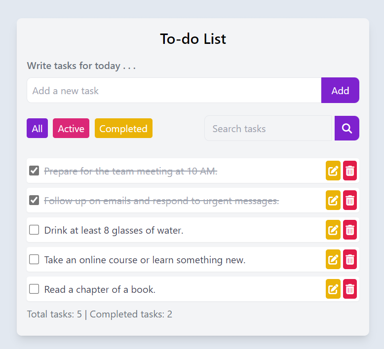

# To-Do List Web App 📝

A simple and accessible to-do app to help you stay organized and productive. Create, manage, and prioritize your tasks with ease. ✅

## Table of Contents

- [Introduction](#introduction)
- [Features](#features)
- [Live Demo](#live-demo)
- [Usage](#usage)
- [Contributing](#contributing)

## Introduction 🚀

This is a straightforward to-do list web application built using HTML, CSS, and JavaScript. It allows users to add, edit, and delete tasks, filter tasks by status, and search for specific tasks. The application also stores tasks locally, so you won't lose your tasks when you refresh the page.

## Features 🌟

- Add tasks to your to-do list.
- Mark tasks as completed or active.
- Edit existing tasks.
- Delete tasks you no longer need.
- Filter tasks by status (All, Active, Completed).
- Search for tasks by keyword.
- Tasks are saved locally in your browser.

## Live Demo 🎉

Check out the live demo [here]([https://your-demo-link.com](https://elafsh-todo-app.netlify.app/)).

## Usage 🛠️

1. Clone or download the repository to your local machine.
2. Open the `index.html` file in a web browser.

## Contributing 🤝

If you'd like to contribute to this project, please follow these steps:

1. Fork the repository.
2. Create a new branch for your feature or bug fix.
3. Make your changes and commit them.
4. Push your changes to your fork.
5. Create a pull request to the main repository.

---

Feel free to use this to-do list web app to help you manage your tasks and stay organized! If you have any questions or encounter issues, please open an issue in the repository. 😊
